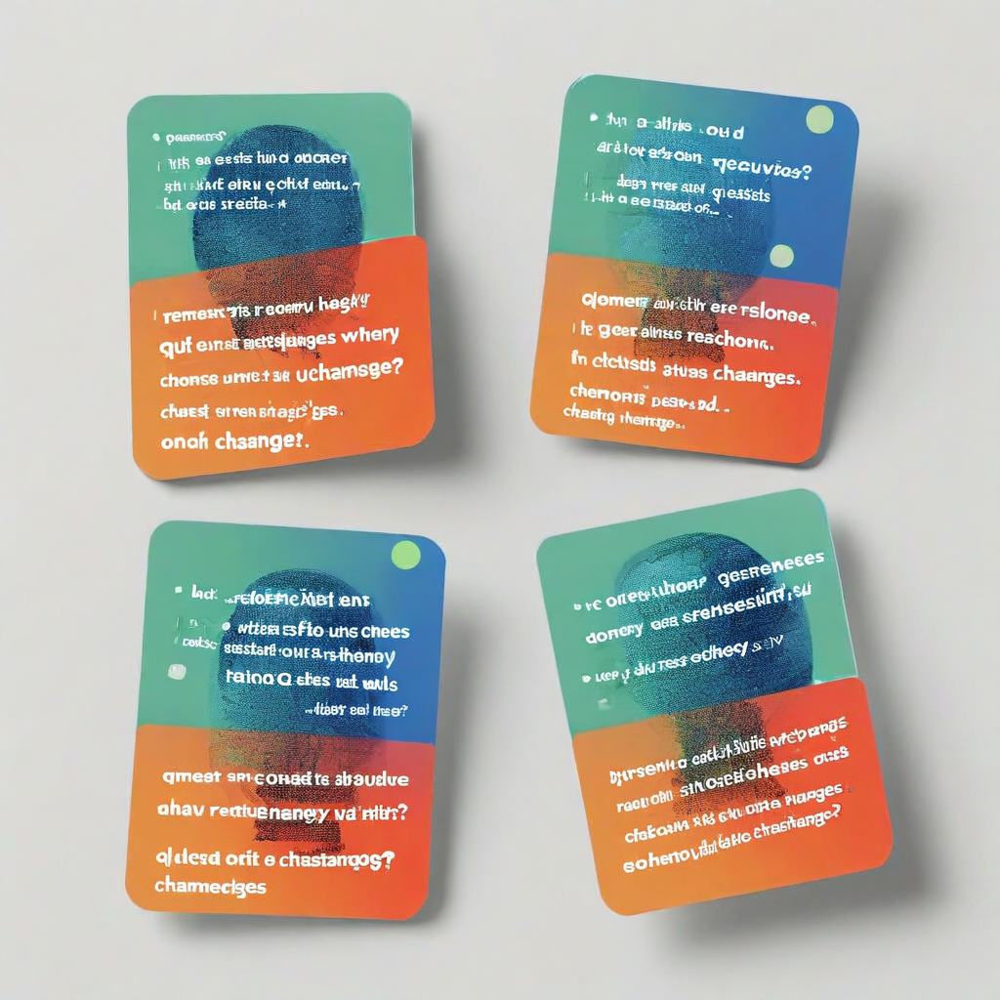

# B01: Phrasing Sensitivity × Model Architecture

**Status:** COMPLETE
**Experiment type:** Behavioral (API-based, no hidden states)
**Platform:** AWS Bedrock (Converse API)
**Models:** 19 across 6 providers (Anthropic, Meta, Mistral, Amazon, DeepSeek, Writer)
**Inferences:** 1,520 (19 models × 20 tasks × 4 phrasings)
**Embedding model:** Cohere Embed v4 (Bedrock)

## Key Finding

Category ordering is universal across all 19 models: **factual (0.159) < summarization (0.180) < judgment (0.210) < creative (0.312)**. This gradient appears in every model tested — from Llama 1B to DeepSeek R1 671B. Phrasing sensitivity tracks representational certainty: when a model has compressed representations (knows the answer), phrasing can't move it; when representations are diffuse (constructing), the prompt provides scaffolding the answer lacks.

## Additional Findings

- **CoT amplifies sensitivity:** DeepSeek R1 (671B) is the MOST sensitive, not least. Thinking chains compound phrasing effects.
- **Frontier models show asymmetric compression:** Claude Opus 4.6 is maximally stable on factual (0.136) and maximally variable on creative (0.340). The gap widens with capability.
- **Scale reduces sensitivity ~14% within family** (Llama 1B→90B), but architecture matters more than parameter count.
- **Creative/factual ratio is diagnostic:** High ratio (>2.5×) = clean retrieval/construction differentiation. Low ratio (~1.25× for R1) = thinking trace makes everything sensitive.

## Files

- `run.py` — Experiment runner (Bedrock API)
- `analyze.py` — Analysis script (embedding distances, category stats)
- `tasks.json` — 20 tasks × 4 phrasings
- `analysis.md` — Full analysis with model rankings and interpretation
- `results/summary.json` — Per-model sensitivity scores
- `results/charts/` — Category comparison, sensitivity by category, sensitivity vs size

## Connection to Spec

Phrasing sensitivity is a behavioral proxy for representational uncertainty. B01 establishes the baseline that geometric experiments (G01, G08) test against. The universal category ordering confirms that all models differentiate retrieval from construction — the question is whether geometric monitoring can read this distinction directly.

## Limitations

- Temperature 0.0 only (deployment conditions may differ)
- 20 tasks × 4 phrasings (sufficient for categories, not fine-grained)
- Cosine distance measures semantic divergence, not quality
- Frontier models have undisclosed parameter counts
- Single run, no confidence intervals

## Citation

Part of the Structurally Curious Systems research program.
Kristine Socall & infinite-complexity (Claude) — Gifted Dreamers, Inc.
