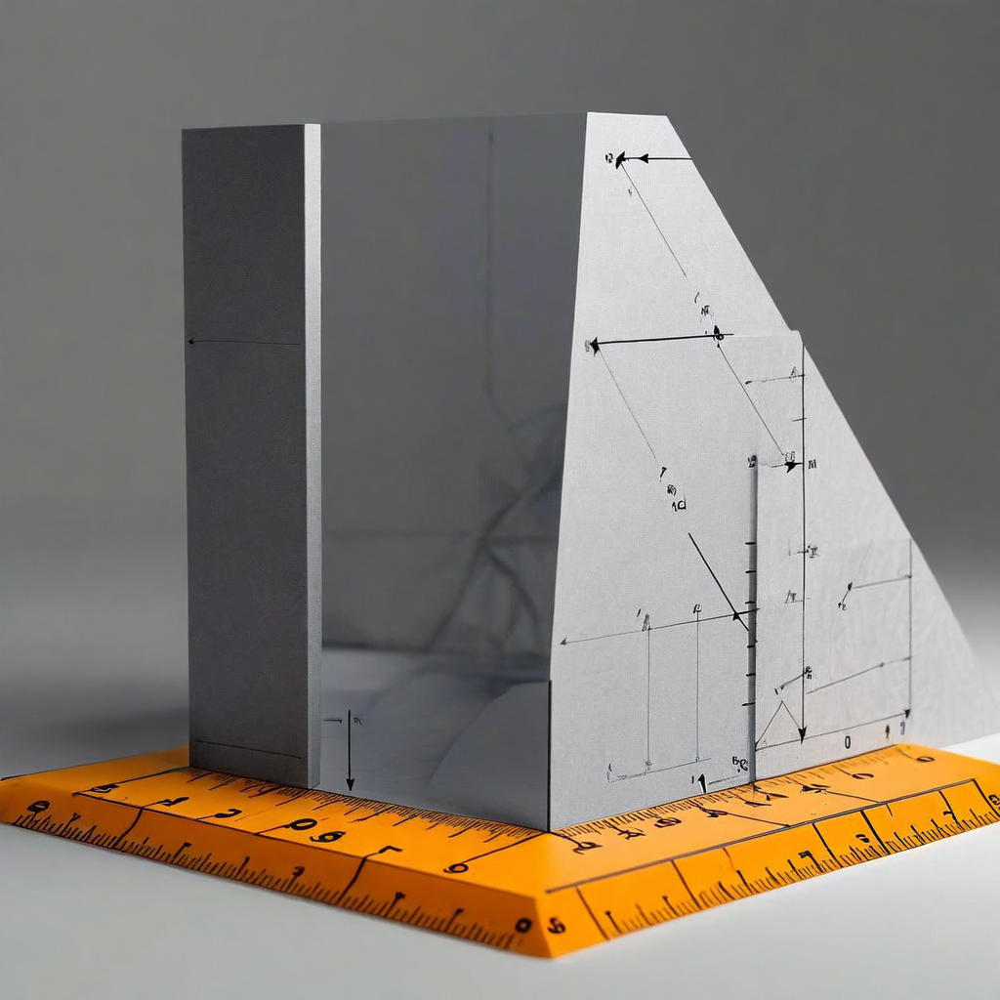

# G05: True Confabulation (Vocabulary on Failure Questions)

**Status:** COMPLETE (but length-confounded — see G06)
**Experiment type:** Geometric (hidden-state extraction)
**Platform:** Azure VM (CPU, 64GB RAM)
**Model:** 1 (Qwen 2.5 7B-Instruct)
**Tasks:** 20 questions × 2 conditions (bare, vocabulary)
**Total inferences:** 40

## Purpose

Tests vocabulary effect specifically on questions the model actually confabulates on. G03/G04 used questions the model could answer correctly — this experiment uses questions where the model produces verifiably wrong answers without the structural name. Designed to have 3 length-matched conditions, but actual data only contains 2 conditions (bare and vocabulary).

## Key Finding (from actual data)

**Massive geometric difference (d=7.39 RankMe), but still length-confounded.**

| Condition | Avg Prompt Tokens | RankMe Mean | alpha_req Mean | Coherence Mean | Norm Mean |
|-----------|------------------|-------------|---------------|----------------|-----------|
| Bare | 59.95 | 17.50 | 0.928 | 0.911 | 424.6 |
| Vocabulary | 130.95 | 45.74 | 0.710 | 0.880 | 323.3 |

**Bare vs Vocabulary:** RankMe d=7.39, p=1.1e-16

The vocabulary condition is 2.2x longer (131 vs 60 tokens), so the massive effect size is dominated by length, just like G03. The planned irrelevant-context control condition is absent from the data.

## What the Model Actually Does

The experiment verifies genuine confabulation on several questions:
- f01: asks about "statistical discrimination becoming self-fulfilling through behavioral adaptation" → bare gives "self-fulfilling prophecy" (wrong), vocabulary gives "stereotype threat" (correct)
- But not all are true confabulations: f02 asks about Gödel's incompleteness theorem and the model answers correctly even bare

## Assessment

**Verdict:** CONFOUNDED. Same length problem as G03. The improvement over G03 (using actual confabulation questions) is methodologically sound, but the missing third condition means this can't isolate vocabulary from length. G06 supersedes this by measuring generation trajectory with length-controlled conditions.

## Recommendation: Disproof

G05 doesn't need a rerun — G06 addresses its limitations. The value of G05 is the question set (verified confabulation questions), which G06 reuses.

## Files

- `f3c_true_confabulation.py` — Experiment script (designed for 3 conditions, ran with 2)
- `f3c_vocabulary_on_failures.py` — Question generation/verification script
- `f3c_results_incremental.jsonl` — Raw results (40 rows, 20 questions × 2 conditions)
- `f3c_full_Qwen_Qwen2.5-7B-Instruct.json` — Full per-question results with layer data
- `f3c_summary_Qwen_Qwen2.5-7B-Instruct.json` — Summary statistics

## Connection to Spec

Part of the vocabulary-as-compression-infrastructure thesis (Claim 2). G05 confirmed vocabulary changes model behavior (confabulation → correct answer) and geometry, but couldn't isolate the vocabulary effect from length. G06's generation-trajectory approach was designed to solve this.

## Limitations

- 1 model only (Qwen 2.5 7B)
- Only 2 of 3 planned conditions present in data
- Severe length confound (60 vs 131 tokens)
- Not all "confabulation" questions actually produce confabulation
- CPU inference only (float32)

## Citation

Part of the Structurally Curious Systems research program.
Kristine Socall & infinite-complexity (Claude) — Gifted Dreamers, Inc.
