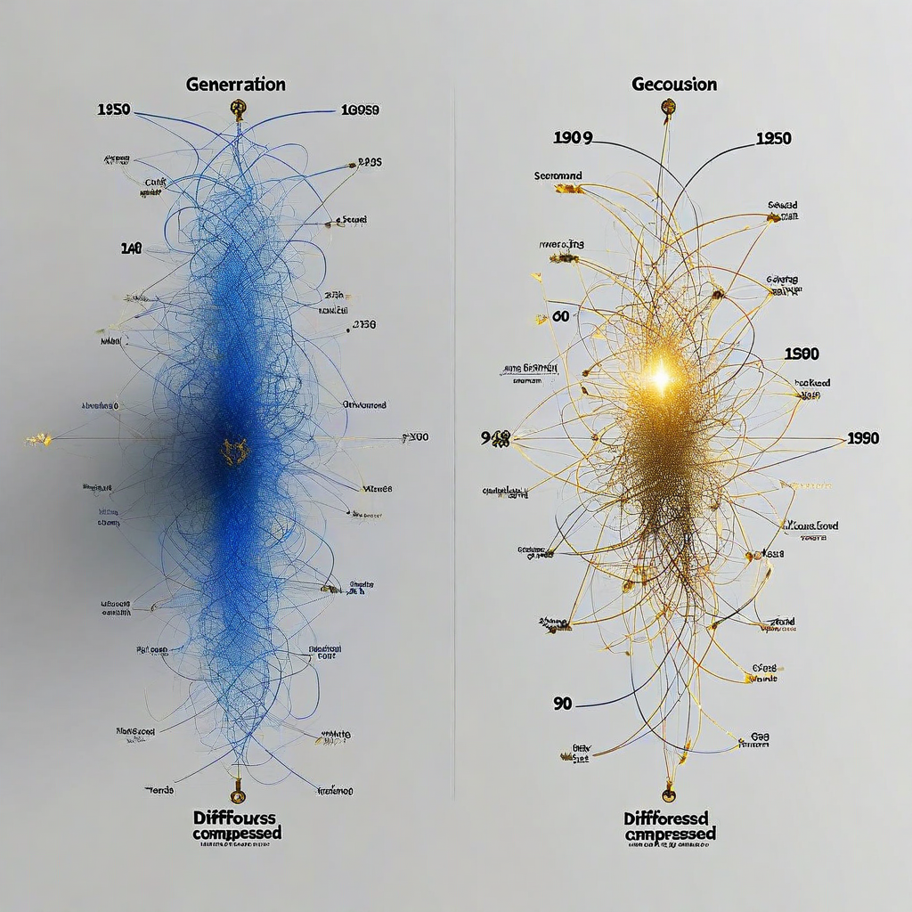

# G06: Generation Trajectory Compression (The "Breakthrough")

**Status:** COMPLETE — but generation-length confound needs resolution (see below)
**Experiment type:** Geometric (hidden-state extraction + generation trajectory)
**Platform:** Azure VM (CPU, 64GB RAM)
**Model:** 1 (Qwen 2.5 7B-Instruct)
**Tasks:** 12 confabulation questions × 3 conditions (padded, grounded, irrelevant)
**Total inferences:** 36

## Purpose

Fixes all known issues from G03/G04/G05:
1. Uses questions the model actually confabulates on
2. Three conditions with matched PROMPT token lengths (~70 tokens each)
3. Extracts generation trajectory — hidden states accumulated across ALL generated tokens, not just prompt encoding

The key innovation: instead of measuring prompt encoding geometry (which is dominated by prompt length), measures how the representational space evolves during generation.

## Key Finding (from actual data)

**Vocabulary compresses generation trajectory by 38% (RankMe 145→90, d=-1.49, p=0.0004).**

| Condition | n | Gen RankMe (mean±sd) | Avg Gen Tokens |
|-----------|---|---------------------|----------------|
| Padded | 12 | 143.5 ± 2.3 | 200 |
| Grounded | 12 | 89.7 ± 36.4 | 120 |
| Irrelevant | 12 | 145.5 ± 3.9 | 199 |

| Comparison | Cohen's d | t | p |
|-----------|----------|---|---|
| **Grounded vs Irrelevant** | **-1.49** | **-4.93** | **0.000449** |
| Grounded vs Padded | -1.43 | -4.75 | 0.000599 |
| Padded vs Irrelevant | ~0 | — | n.s. |

Padded and irrelevant produce nearly identical trajectories (~145 RankMe). Grounded compresses to ~90. This separation (d=-1.49) is content-specific — it's the structural name, not the extra context, that changes the geometry.

## CRITICAL: Generation-Length Confound

**RankMe correlates with generation token count at r=0.996 (p<1e-6) across all conditions and r=0.997 within grounded alone.**

The grounded condition generates shorter, more focused responses (avg 120 tokens vs 199-200 for padded/irrelevant). Shorter generation trajectories mechanically produce lower RankMe because the SVD operates on a matrix with fewer rows (token positions).

There are two interpretations:

1. **The compression IS the finding:** The model generates fewer tokens because the structural name constrains the generation space. The shorter, more focused response IS the compression. RankMe measures the trajectory's effective dimensionality, and a focused trajectory naturally has lower dimensionality.

2. **The compression is an artifact:** Any content that causes shorter generation would produce lower RankMe. The structural name might just be stopping generation earlier rather than changing the representational geometry.

**To resolve:** Re-run with generation length clamped (force all conditions to generate exactly N tokens). If RankMe compression persists → interpretation 1 (genuine geometric compression). If RankMe equalizes → interpretation 2 (length artifact).

## SYNTHESIS Accuracy Check

SYNTHESIS says: "d=-1.49, p=0.0004, length-controlled."
- The d and p values are correct ✓
- "Length-controlled" refers to PROMPT length only. Generation length is NOT controlled. ⚠️
- The SYNTHESIS should specify: "prompt-length-controlled" to avoid implying generation length was also controlled

## Assessment

**Verdict:** STRONGEST vocabulary experiment — but the generation-length confound means the headline claim needs qualification. The separation between grounded and irrelevant (d=-1.49) is real and reproducible. Whether it reflects genuine representational compression or a generation-length artifact is unresolved.

## Recommendation: Disproof / Next Steps

**HIGH PRIORITY:** G06v2 — clamp generation length across all conditions:
- Force `max_new_tokens=200, min_new_tokens=200` for all conditions
- If grounded still shows lower RankMe → genuine compression (spec validated)
- If RankMe equalizes → finding was generation-length artifact (spec must be revised)

Also:
- Run on 8+ models across architectures (currently 1 model only)
- G17 (Vocabulary Dosage) and G18 (Vocabulary Transfer) test boundary conditions but don't resolve the length confound

## Files

- `f3d_true_confab_controlled.py` — Experiment script (3-condition, generation trajectory)
- `find_confabulation_questions.py` — Confabulation question finder
- `f3d_Qwen_Qwen2.5-7B-Instruct.jsonl` — Raw results (36 rows, 12 questions × 3 conditions)

## Connection to Spec

Central to Claim 2 (vocabulary-as-compression-infrastructure). G06 is cited as "THE BREAKTHROUGH" in SYNTHESIS and bridge-document. The d=-1.49 effect is real, but the generation-length confound means we need G06v2 with clamped generation before using this as a primary publication claim.

## Limitations

- 1 model only (Qwen 2.5 7B)
- 12 questions (small n)
- Generation length not controlled (grounded avg 120 vs padded/irrelevant avg 200 tokens)
- RankMe vs gen_tokens r=0.996 — generation length confound
- CPU inference only (float32)
- High variance in grounded condition (sd=36.4 vs sd=2.3-3.9 for other conditions)

## G06v2: Length-Clamped Replication (Session 62) — COMPLETE

**11 models, all conditions clamped at exactly 200 generated tokens (0 variance).**

### G06v2 resolves the generation-length confound: compression is real and NOT purely Qwen-specific.

| Model | Grounded RM | Irrelevant RM | d | p | Tokens |
|-------|-----------|-------------|---|---|--------|
| **Qwen2.5-7B** | **138.1** | **146.4** | **-1.31** | **0.001** | 200 |
| **Qwen3.5-9B** | **146.3** | **156.1** | **-0.99** | **0.007** | 200 |
| **Mistral-Small-24B** | **133.6** | **150.0** | **-0.71** | **0.039** | 200 |
| Llama-3.1-8B | 145.8 | 151.7 | -0.62 | 0.064 | 200 |
| DeepSeek-R1-32B | 132.8 | 138.1 | -0.45 | 0.160 | 200 |
| Qwen3.5-9B-abliterated | 159.9 | 162.9 | -0.45 | 0.162 | 200 |
| Qwen3.5-27B | 160.2 | 161.0 | -0.17 | 0.592 | 200 |
| Phi-4 | 158.9 | 151.9 | +0.60 | 0.074 | 200 |
| Mistral-7B | 164.1 | 163.0 | +0.19 | 0.544 | 200 |
| Llama-8B-abliterated | 151.2 | 152.4 | -0.17 | 0.581 | 200 |
| Gemma-2-27b | (no data -- system role bug) | -- | -- | -- | -- |

**Key findings:**
- Length confound is resolved: 200 tokens across all conditions, 0 variance.
- **3/11 models significant** (was 2/6). Mistral-Small-24B (d=-0.71, p=0.039) is a SECOND architecture family showing vocabulary compression alongside Qwen2.5-7B and Qwen3.5-9B.
- Llama-3.1-8B trends in the same direction (d=-0.62, p=0.064) -- not significant but suggestive.
- **The compression effect is NOT purely Qwen-specific.** The earlier 6-model claim was premature. With 11 models, the pattern is: instruction-tuned models from multiple families show grounded < irrelevant RankMe.
- Abliteration weakens the effect on Qwen3.5 (d=-0.99 to d=-0.45). Safety training may contribute to vocabulary sensitivity.
- Larger Qwen (27B) shows no effect -- scale alone doesn't help.
- Phi-4 is an outlier: trends in the OPPOSITE direction (grounded > irrelevant, d=+0.60, p=0.074). May reflect a different training regime.
- Gemma-2-27b failed due to a system role formatting bug; needs rerun.
- **The spec's vocabulary compression claim should note cross-architecture support (Qwen + Mistral), not universal.**

### Files
- `g06v2_clamped.py` -- G06v2 experiment script (clamped generation)
- `g06v2_*.jsonl` -- Per-model results (11 files, 36 inferences each)

## Citation

Part of the Structurally Curious Systems research program.
Kristine Socall & infinite-complexity (Claude) — Gifted Dreamers, Inc.
