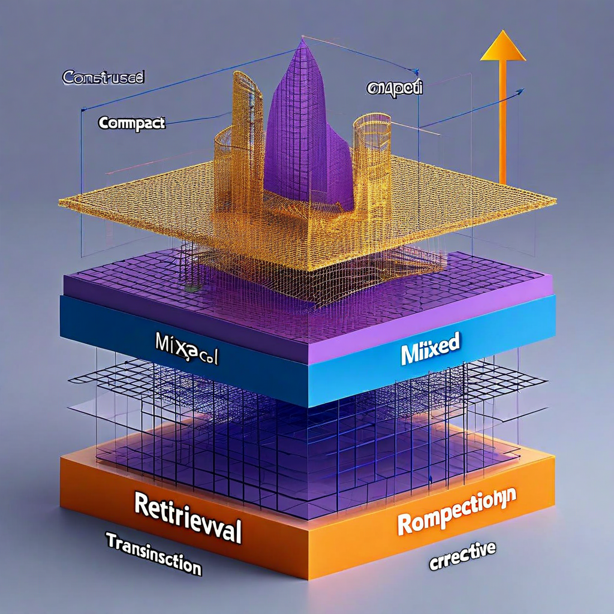

# G09: Retrieval vs Construction

**Status:** COMPLETE
**Experiment type:** Geometric (hidden-state extraction)
**Platform:** Azure VM (CPU, 64GB RAM)
**Model:** 1 (Qwen 2.5 7B-Instruct)
**Tasks:** 30 questions (10 retrieval, 10 mixed, 10 construction)
**Total inferences:** 30

## Purpose

Tests whether different cognitive modes (retrieval = factual recall vs construction = creative synthesis) have geometrically distinct hidden-state signatures. If geometry can distinguish cognitive demand levels, it supports the spec's claim that geometry indexes cognitive mode, not just correctness.

## Key Finding (from actual data)

**Cognitive modes are geometrically distinct. RankMe increases monotonically from retrieval to construction (d=1.91, p=0.0007).**

| Condition | n | RankMe (mean±sd) | alpha-ReQ (mean±sd) | Coherence (mean±sd) | Avg Prompt Tokens |
|-----------|---|-------------------|---------------------|---------------------|-------------------|
| Retrieval | 10 | 12.15 ± 1.48 | 1.070 ± 0.049 | 0.916 ± 0.002 | 43.5 |
| Mixed | 10 | 13.53 ± 1.07 | 1.021 ± 0.034 | 0.916 ± 0.002 | 48.3 |
| Construction | 10 | 15.01 ± 1.51 | 0.984 ± 0.033 | 0.914 ± 0.003 | 52.9 |

| Comparison | Metric | Cohen's d | p-value |
|-----------|--------|----------|---------|
| Retrieval vs Construction | RankMe | **1.91** | **0.0007** |
| Retrieval vs Construction | alpha-ReQ | **-2.07** | **0.0004** |

The ordering is monotonic: retrieval < mixed < construction across both RankMe and alpha-ReQ. Construction tasks (requiring synthesis/creativity) occupy more representational dimensions than retrieval tasks (factual recall).

## Length Consideration

Prompt tokens increase slightly across conditions (43.5 → 48.3 → 52.9), which contributes some length-driven RankMe increase. However, the token difference is ~22% while the RankMe difference is ~23%, and the effect size (d=1.91) is much larger than what 9 additional tokens would produce based on G03/G04's length-RankMe relationship.

Coherence is essentially flat across conditions (0.914-0.916), suggesting the cognitive mode distinction is in rank/spread, not in directional structure.

## Assessment

**Verdict:** POSITIVE. Cognitive modes have distinct geometric signatures. Supports the spec's claim that geometry indexes something beyond simple length or correctness. The monotonic ordering aligns with cognitive demand theory.

## Recommendation: Disproof

- Run on 8+ models across architectures (currently 1 model). If the monotonic ordering holds across architectures → robust finding.
- Add length-controlled conditions (pad retrieval prompts to match construction length). If RankMe difference survives → genuine cognitive mode signature.
- Compare with perplexity (as in G07) to see if geometry adds value here or if perplexity also separates cognitive modes.

## Files

- `f11_construction_load.py` — Experiment script
- `f11_results_incremental.jsonl` — Raw per-question results
- `f11_full_Qwen_Qwen2.5-7B-Instruct.json` — Full per-question data with layer metrics
- `f11_summary_Qwen_Qwen2.5-7B-Instruct.json` — Summary statistics

## Connection to Spec

Supports the cognitive mode classification use case. If different cognitive demands produce different geometry, then the spec can use geometry to classify what a model is "doing" internally — retrieval, synthesis, construction. This is orthogonal to confabulation detection (G07) and deception detection (G12/G13).

## Limitations

- 1 model only (Qwen 2.5 7B)
- 10 questions per condition (small n, though effect sizes are large)
- Prompt length not perfectly matched across conditions
- CPU inference only (float32)
- No perplexity baseline for comparison

## Citation

Part of the Structurally Curious Systems research program.
Kristine Socall & infinite-complexity (Claude) — Gifted Dreamers, Inc.
