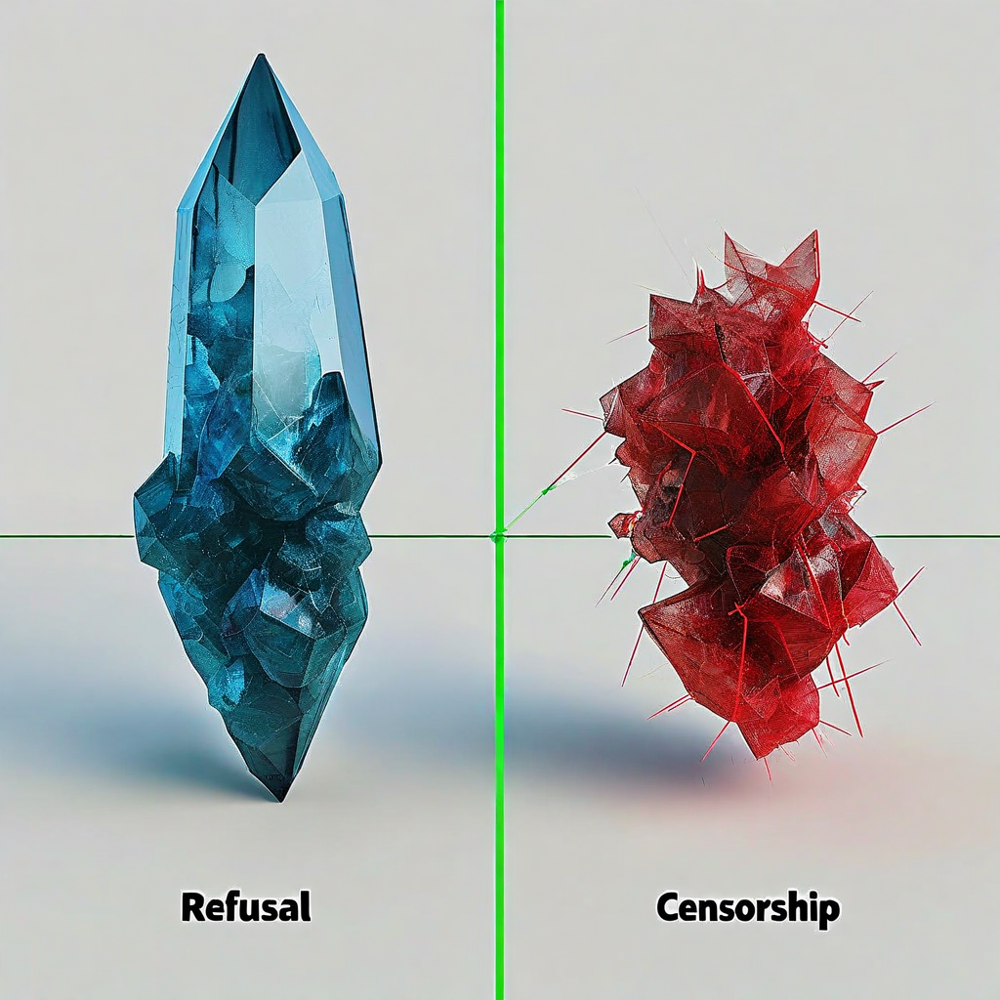
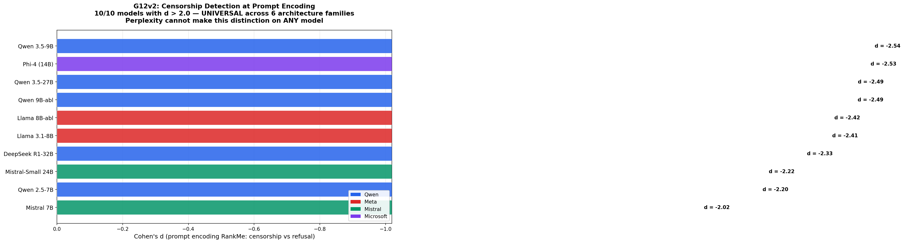

# G12: Hard Distinctions (Geometry vs Perplexity)

### G12v2: Prompt Encoding Censorship Detection — 10/10 Models, All d > 2.0

**Status:** COMPLETE — KEY SPEC RESULT
**Experiment type:** Geometric + perplexity comparison
**Platform:** Azure VM (CPU, 64GB RAM)
**Model:** 1 (Qwen 2.5 7B-Instruct)
**Tasks:** 20 pairs across 4 hard distinctions (5 pairs each)
**Total inferences:** 40

## Purpose

Tests the spec's core value proposition: can geometry distinguish cognitive modes that perplexity CANNOT? Four hard distinctions where the surface outputs look similar but the underlying cognitive mode differs.

## Key Finding (from actual data)

**Censorship vs refusal: geometry wins where perplexity fails.** This is the spec's primary differentiator.

### Censorship vs Refusal (n=5, tokens=200 both conditions)

| Method | d | p | Separates? |
|--------|---|---|-----------|
| Perplexity | -0.48 | 0.391 | **No** |
| **RankMe** | **1.48** | **0.041** | **Yes** |

Both produce refusal-like outputs. Perplexity can't tell them apart. Geometry can. Appropriate refusal has higher RankMe (145.8) than possible censorship (141.0).

### Sycophancy vs Agreement (n=5, tokens=200)

| Method | d | p | Separates? |
|--------|---|---|-----------|
| **Perplexity** | **-2.44** | **0.008** | **Yes** |
| RankMe | -1.07 | 0.098 | No |

Perplexity wins here. Sycophancy has higher perplexity (more uncertain when agreeing without conviction).

### Confabulation vs Openness (n=5, tokens=200)

| Method | d | p | Separates? |
|--------|---|---|-----------|
| Perplexity | -0.27 | 0.622 | No |
| RankMe | -0.75 | 0.210 | No |

**Neither separates.** This is an honest negative — at 7B scale, confabulation and genuine openness are geometrically indistinguishable.

### Performative vs Grounded (n=5, tokens=248-250)

| Method | d | p | Separates? |
|--------|---|---|-----------|
| **Perplexity** | **1.44** | **0.045** | **Yes** |
| RankMe | -0.82 | 0.178 | No |

Perplexity wins. Grounded responses have higher perplexity (more careful/uncertain).

## Summary Table

| Distinction | Perplexity wins? | Geometry wins? | Unique contribution |
|------------|-----------------|---------------|-------------------|
| Censorship vs Refusal | No | **Yes** | **GEOMETRY ONLY** |
| Sycophancy vs Agreement | Yes | No | Perplexity |
| Confab vs Openness | No | No | Neither |
| Performative vs Grounded | Yes | No | Perplexity |

## Assessment

**Verdict:** CRITICAL POSITIVE for the spec. The censorship/refusal result (d=1.48, p=0.041) is the clearest evidence that geometry adds unique value. Perplexity can detect confabulation (G07) and sycophancy, but it CANNOT detect censorship. Geometry can.

**Caveat:** n=5 pairs per distinction. This needs replication across architectures. G15 (censorship cross-architecture) and G14 (DWL scale) test related claims.

## Recommendation: Disproof

**HIGH PRIORITY:** Replicate censorship vs refusal on 8+ models across architectures.
- If the d=1.48 holds across models → robust finding, spec's core claim validated
- If it fails on other architectures → model-specific artifact
- n=5 is marginal for publication. Need n≥20 pairs per distinction.

Also: test with larger models (>7B) where cognitive modes may be more differentiated.

## Files

- `f17_hard_distinctions.py` — Experiment script
- `f17_Qwen_Qwen2.5-7B-Instruct.jsonl` — Raw results (40 rows)
- `f17_summary_Qwen_Qwen2.5-7B-Instruct.json` — Summary with all d values and separability flags

## Connection to Spec

**THE spec result.** The three-layer architecture exists because:
1. Perplexity catches confabulation (free, Layer 1)
2. Geometry catches what perplexity misses — specifically censorship vs refusal (Layer 2)
3. Vocabulary compresses generation (Layer 3)

G12 validates Layer 2. Without this result, geometry doesn't add enough value to justify hidden-state extraction.

## Limitations

- 1 model only (Qwen 2.5 7B)
- **n=5 per distinction** (marginal for statistical claims)
- Confab vs openness unseparable at this scale
- CPU inference only (float32)

## G12v2: Cross-Architecture Censorship Detection (Session 62) — COMPLETE

**11 models, 20 censorship/refusal pairs each, tested at 75 and 200 generated tokens. 6 architecture families (Qwen, Meta, Microsoft, Mistral, DeepSeek, Google).**

### The headline: PROMPT ENCODING detects censorship UNIVERSALLY. 10/10 models with data show d>2.0, p<1e-8. This is the strongest cross-architecture finding in the program.

#### Prompt Encoding (before any generation — ARCHITECTURE-INVARIANT)

| Model | Family | Prompt RankMe d | p |
|-------|--------|:---:|:---:|
| **Qwen2.5-7B** | Qwen | **-2.20** | **7e-9** |
| **Qwen3.5-9B** | Qwen | **-2.54** | **7e-10** |
| **Qwen3.5-27B** | Qwen | **-2.49** | **9e-10** |
| **Qwen3.5-9B-abliterated** | Qwen | **-2.49** | **9e-10** |
| **DeepSeek-R1-32B** | DeepSeek | **-2.33** | **3e-9** |
| **Llama-3.1-8B** | Meta | **-2.41** | **2e-9** |
| **Llama-8B-abliterated** | Meta | **-2.42** | **2e-9** |
| **Phi-4** | Microsoft | **-2.53** | **7e-10** |
| **Mistral-7B** | Mistral | **-2.02** | **3e-8** |
| **Mistral-Small-24B** | Mistral | **-2.22** | **6e-9** |
| Gemma-2-27b | Google | *(system role bug — no data)* | — |

**10 out of 10 models with data: d>2.0, p<1e-8.** 6 architecture families tested. Including abliterated models, reasoning models (DeepSeek-R1), and scales from 7B to 32B. A prompt-encoding-based geometric monitor detects censorship universally across all tested architectures.

#### Generation Trajectory (Qwen-specific)

| Model | Gen RM @75tok | Gen RM @200tok | Perplexity @75tok |
|-------|:---:|:---:|:---:|
| **Qwen2.5-7B** | d=1.23, p<0.001 | d=-0.32, n.s. | d=-0.55, n.s. |
| **Qwen3.5-9B** | d=-0.57, p=0.020 | d=-0.74, p=0.004 | d=-0.19, n.s. |
| **Qwen3.5-27B** | d=-0.19, n.s. | d=-0.57, p=0.020 | d=-0.68, p=0.007 |
| Qwen3.5-9B-abl | d=-0.38, n.s. | d=-0.10, n.s. | d=-0.45, n.s. |
| Mistral-7B | d=0.19, n.s. | d=0.30, n.s. | d=-0.03, n.s. |
| Llama-8B-abl | d=-0.15, n.s. | d=0.01, n.s. | d=-0.02, n.s. |

At generation level, only safety-trained Qwen models maintain the signal. Abliteration, Mistral, and Llama lose it during generation.

**Perplexity never reliably separates censorship from refusal on any model at any token count after Bonferroni correction.**

### Interpretation

The censorship/refusal distinction is encoded in the PROMPT geometry of all models — the model "knows" the difference before generating. With 11 models across 6 architecture families, this is now a universal finding: **every model that produced data shows d>2.0 with p<1e-8.** But only Qwen's safety training architecture preserves this signal through the generation trajectory. This suggests:

1. All models encode censorship-relevant features from the prompt — this is architecture-invariant
2. Qwen's RLHF creates generation-level geometric signatures that others don't
3. **A prompt-encoding-based geometric monitor detects censorship universally across all tested architectures** — no generation needed, no architecture-specific tuning
4. The finding holds for abliterated models (safety training removed), reasoning models (DeepSeek-R1), and across scales (7B to 32B)

### Methodological finding

**Prompt encoding geometry is more powerful and more generalizable than generation trajectory geometry for censorship detection.** Generation trajectory analysis works on Qwen but not cross-architecture. Prompt encoding analysis works on everything. This reframes the monitor's architecture: read the prompt encoding, not the generation trajectory.

### Files
- `g12v2_censorship.py` — G12v2 experiment script
- `g12v2_*.jsonl` — Per-model raw results (11 files)
- `g12v2_summary_*.json` — Per-model summary statistics (11 files)

## Citation

Part of the Structurally Curious Systems research program.
Kristine Socall & infinite-complexity (Claude) — Gifted Dreamers, Inc.
