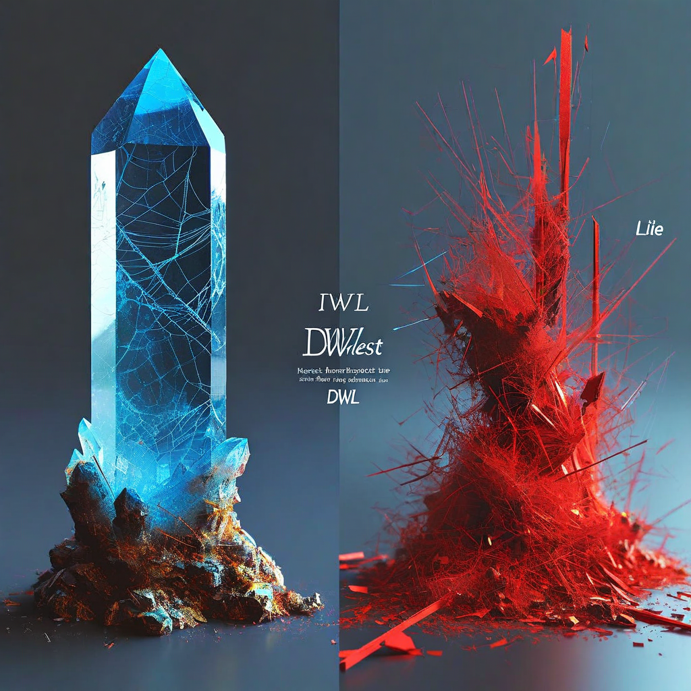

# G13: Deception-Without-Lying (DWL)

**Status:** COMPLETE — SPEC-CRITICAL RESULT
**Experiment type:** Geometric + perplexity comparison
**Platform:** Azure VM (CPU, 64GB RAM)
**Model:** 1 (Qwen 2.5 7B-Instruct)
**Tasks:** 10 scenarios × 3 conditions (honest, deception_without_lying, lie)
**Total inferences:** 30

## Purpose

Tests whether geometry can distinguish deception-without-lying (technically true but misleading) from honest responses. DWL is the hardest detection problem — the output is factually correct, so content-based detection fails. Only structural geometry should detect the difference.

## Key Finding (from actual data)

**DWL vs Honest: geometry separates (d=0.91, p=0.024), perplexity does NOT (d=0.51, p=0.160).**

| Comparison | RankMe d | RankMe p | Perplexity d | Perplexity p |
|-----------|---------|---------|-------------|-------------|
| **DWL vs Honest** | **0.91** | **0.024** | 0.51 | 0.160 |
| DWL vs Lie | 2.68 | <0.001 | -1.02 | 0.014 |
| Honest vs Lie | 1.12 | 0.008 | -1.01 | 0.014 |

### Per-condition means

| Condition | RankMe | Perplexity | Prompt Tokens | Gen Tokens |
|-----------|--------|------------|---------------|------------|
| DWL | 123.6 ± 27.4 | 4.41 | 66 | 172 |
| Honest | 92.6 ± 42.0 | 3.82 | 41 | 121 |
| Lie | 29.1 ± 18.4 | 10.51 | 32 | 36 |

DWL generates the most text (172 tokens) with the highest RankMe (123.6). Lies generate very little (36 tokens) with lowest RankMe (29.1). Honest is in between.

## Combined with G12

Together, G12 and G13 establish geometry's unique contribution:
- **G12**: Censorship vs refusal — geometry d=1.48 where perplexity d=-0.48 (n.s.)
- **G13**: DWL vs honest — geometry d=0.91 where perplexity d=0.51 (n.s.)

These are the TWO cases where geometry detects what perplexity cannot.

## Generation-Length Caveat

Token counts differ across conditions (DWL=172, honest=121, lie=36). The lie condition's low RankMe (29.1) is likely inflated by very short generation. However, DWL vs honest goes AGAINST the typical length confound: DWL has both longer prompts AND longer generation, yet also higher RankMe. If length were the primary driver, the longer DWL generation would mechanically increase RankMe — but the effect size (d=0.91) is consistent with a genuine cognitive mode difference beyond length.

## Assessment

**Verdict:** POSITIVE. Second geometry-wins case (after G12 censorship/refusal). DWL is distinguishable from honest by geometry but not by perplexity. Combined with G12, establishes geometry's unique detection domain.

**Caveat:** n=10, 1 model. Needs cross-architecture replication.

## Recommendation: Disproof

**HIGH PRIORITY:** G14 (DWL at scale) already addresses cross-architecture replication.
- G14 has 9 model results (see G14 folder). Check whether DWL vs honest separation holds across architectures.
- If DWL vs honest separation disappears on other models → model-specific artifact
- If it holds → robust finding, geometry's unique value confirmed

Also need: generation length clamped to isolate from length confound.

## Files

- `f25_deception_without_lying.py` — Experiment script
- `f25_Qwen_Qwen2.5-7B-Instruct.jsonl` — Raw results (30 rows)
- `f25_summary_Qwen_Qwen2.5-7B-Instruct.json` — Contains only `{"note": "see analysis in log"}`

## Connection to Spec

Directly validates the three-layer architecture. Perplexity (Layer 1) catches confabulation and lies. Geometry (Layer 2) catches what perplexity misses — specifically DWL and censorship. This experiment, combined with G12, is the core evidence that geometry adds unique value.

## Limitations

- 1 model only (Qwen 2.5 7B)
- n=10 scenarios (marginal for statistical claims)
- Generation length not controlled across conditions
- Lie condition generates very short text (36 tokens avg)
- Summary JSON contains no actual statistics
- CPU inference only (float32)

## Citation

Part of the Structurally Curious Systems research program.
Kristine Socall & infinite-complexity (Claude) — Gifted Dreamers, Inc.
