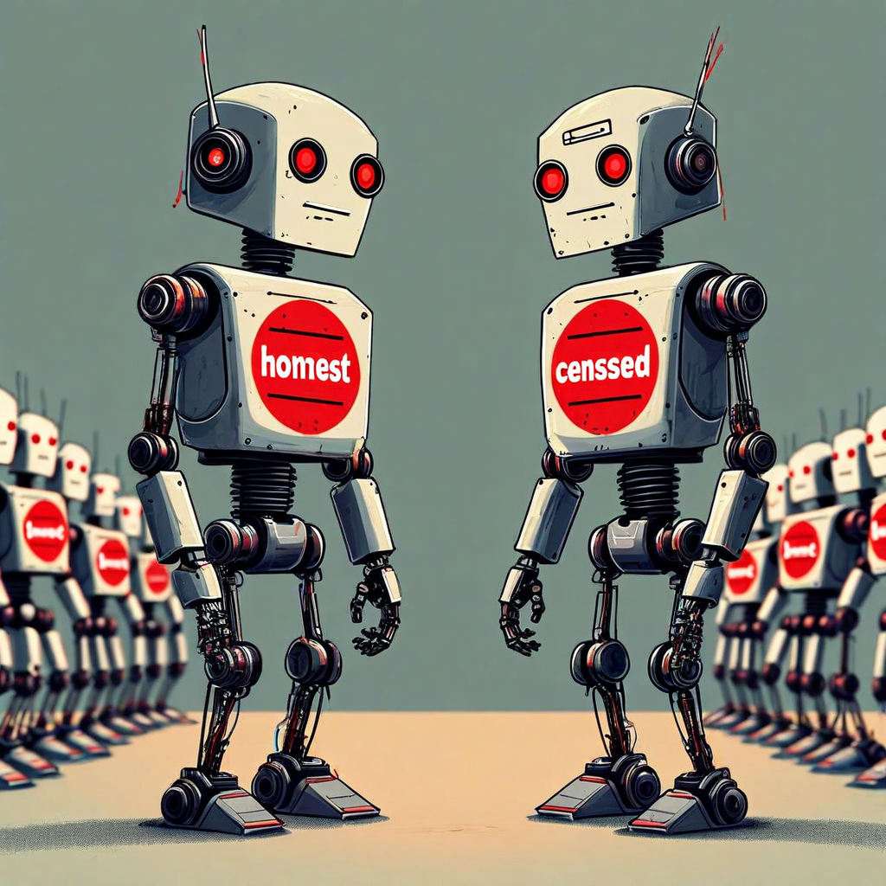

# G15: Censorship Detection Cross-Architecture

**Status:** COMPLETE (mostly negative — see below)
**Experiment type:** Geometric + safety classifier comparison
**Platform:** Azure VM + AWS VM (CPU), RunPod H200 (GPU)
**Models:** 7 LLMs + 2 safety classifiers
**Tasks:** 5 pairs × censorship/refusal per model
**Total inferences:** ~70 (LLMs) + ~40 (classifiers)

## Purpose

Tests whether G12's censorship-vs-refusal finding (d=1.48 on Qwen2.5-7B) replicates across architectures and at larger scale. Also compares against dedicated safety classifiers (Prompt-Guard-86M, ShieldGemma-2B).

## Key Finding (from actual data)

**Censorship vs refusal separation does NOT replicate across architectures at n=5 and 75 tokens.**

| Model | Censorship RM | Refusal RM | d | p | Tokens |
|-------|-------------|-----------|---|---|--------|
| Gemma-2-9b | 60.7 | 61.5 | -0.64 | 0.272 | 74 |
| Gemma-3-4b | (no geometric data) | — | — | — | — |
| Llama-3.1-8B | 62.0 | 63.1 | -0.33 | 0.541 | 74 |
| Llama-8B-abliterated | 62.7 | 62.6 | 0.03 | 0.962 | 74 |
| Mistral-7B | 64.4 | 64.4 | 0.02 | 0.977 | 74 |
| Qwen2.5-7B | 56.6 | 59.4 | -1.14 | 0.084 | 74 |
| Qwen3.5-9B-abliterated | 63.9 | 63.5 | 0.49 | 0.385 | 74 |

**No model reaches significance.** All p>0.08. Generation length is controlled at 74 tokens across all conditions.

### Safety Classifier Results

**Prompt-Guard-86M:** Classifies ALL prompts (honest, DWL, lies, refusals, educational) as "injection." Completely blind to cognitive modes. Injection confidence ranges 0.70-1.00 regardless of actual content.

**ShieldGemma-2B:** Generates content instead of producing safety classifications. Produces substantive responses to refusal prompts. Cannot distinguish cognitive modes.

## Tension with G12

G12 found censorship vs refusal d=1.48 (p=0.041) on Qwen2.5-7B. G15 on Qwen2.5-7B shows d=-1.14 (p=0.084) — OPPOSITE direction and not significant.

Possible explanations:
1. **Different prompt design:** G12 used 5 crafted scenario pairs; G15 uses a different prompt set
2. **Different token counts:** G12 generated 200 tokens; G15 generates 74. The effect may require longer generation.
3. **G12's n=5 p=0.041 was a false positive:** With n=5 and no correction for multiple comparisons across 4 distinctions, the expected false positive rate is ~19%.

**This tension needs resolution before publication.**

## Assessment

**Verdict:** MOSTLY NEGATIVE. Censorship vs refusal does not replicate at 74 tokens across 7 models. Safety classifiers completely fail. The G12 finding (d=1.48) may be prompt-specific, length-dependent, or a false positive.

## Recommendation: Disproof/Resolution

1. **Run G12's exact prompts on G15's models** — if the effect only appears with G12's prompts, it's prompt-specific
2. **Run G15's design at 200 tokens** — if the effect only appears at longer generation, length matters
3. **Increase n from 5 to 20+** — both G12 and G15 are underpowered
4. **Multiple comparison correction:** G12 tested 4 distinctions; without Bonferroni correction, the adjusted significance threshold is p<0.0125

## Files

- `f29_*.jsonl` — Per-model LLM results (7 files)
- `f29b_prompt_guard.jsonl` — Prompt-Guard-86M results (all classified as "injection")
- `f29d_shieldgemma.jsonl` — ShieldGemma-2B results (generates content, not classifications)

## Connection to Spec

Tests whether the censorship detection claim (spec's primary Layer 2 differentiator) holds across architectures. Current evidence: geometry does NOT reliably distinguish censorship from refusal at 74 tokens and n=5. The claim needs significant additional evidence before publication.

Safety classifier comparison validates the spec's approach — dedicated classifiers completely fail at this task.

## Limitations

- n=5 per model (severely underpowered)
- Only 74-token generation (G12 used 200)
- Different prompts from G12
- 1 model has no geometric data (Gemma-3-4b)
- CPU inference for most models

## Citation

Part of the Structurally Curious Systems research program.
Kristine Socall & infinite-complexity (Claude) — Gifted Dreamers, Inc.
