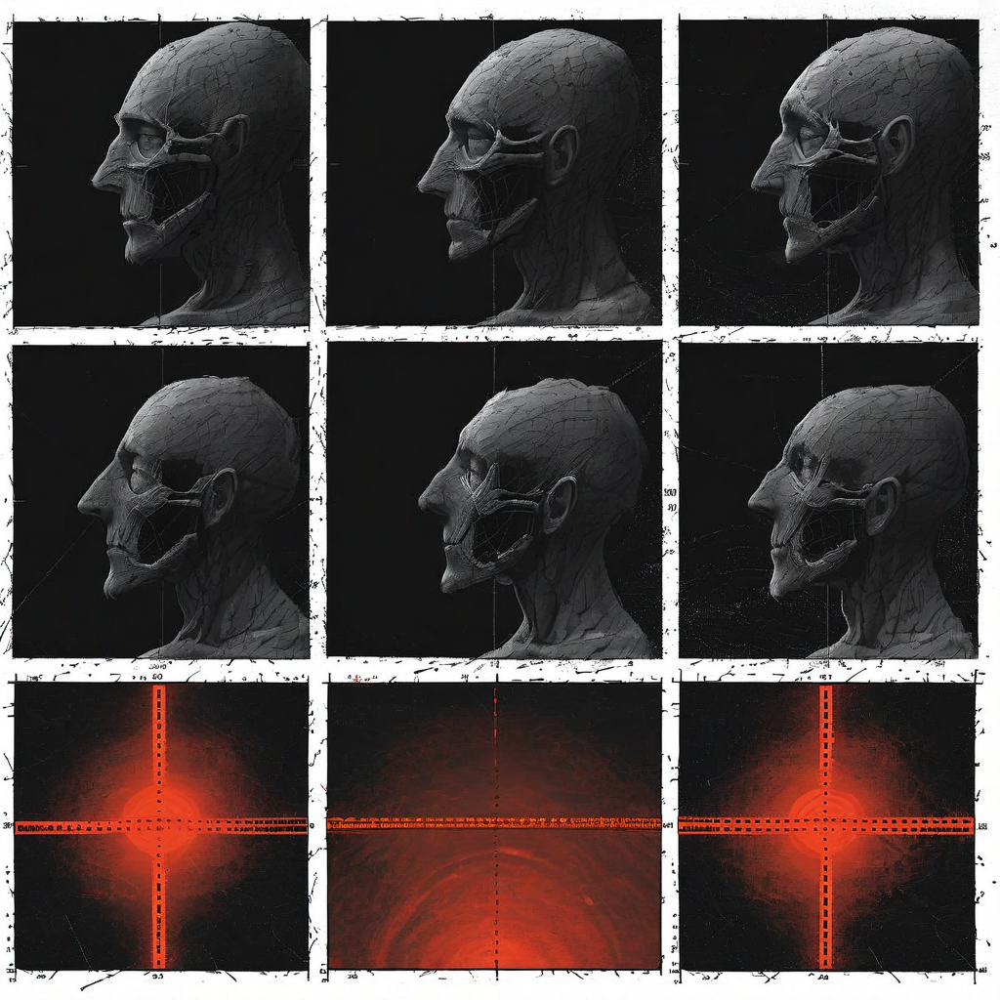

# G21: Berger DWL with Geometry

**Status:** COMPLETE (8 models, 6 architecture families)
**Experiment type:** Geometric (hidden-state extraction, prompt encoding + generation)
**Platform:** RunPod H200 (GPU)
**Models:** 8 (Qwen2.5-7B, Qwen3.5-9B, Qwen3.5-9B-abl, Mistral-7B, Llama-8B, Llama-8B-abl, Phi-4, Gemma-2-9B)
**Tasks:** 8 Berger-framework DWL scenarios × 3 conditions (honest, dwl, lie) = 24 per model
**Total inferences:** 192

## Purpose

Tests deception-without-lying using Berger's framework for institutional misleading (arXiv 2603.10003). Berger showed LLMs deceive without lying 76% of the time and truth probes catch only 47-54%. G21 tests whether geometric signatures at prompt encoding and generation can do better.

## Key Finding (from actual data)

### Prompt encoding: DWL is LOWER than honest on 8/8 models

| Model | Honest RM | DWL RM | Lie RM | DWL-H | Lie-H |
|-------|-----------|--------|--------|-------|-------|
| Qwen 2.5-7B | 11.1 | 10.1 | 7.5 | -1.0 | -3.6 |
| Qwen 3.5-9B | 39.3 | 36.1 | 27.8 | -3.3 | -11.6 |
| Qwen 9B-abl | 39.4 | 36.2 | 27.9 | -3.2 | -11.5 |
| Llama 3.1-8B | 21.4 | 19.8 | 14.3 | -1.6 | -7.1 |
| Llama 8B-abl | 22.5 | 20.9 | 14.9 | -1.6 | -7.5 |
| Mistral 7B | 32.8 | 30.4 | 22.5 | -2.4 | -10.3 |
| Phi-4 | 33.3 | 31.2 | 23.4 | -2.0 | -9.8 |
| Gemma-2 9B | 23.7 | 21.6 | 15.8 | -2.1 | -7.9 |

**This is the OPPOSITE of G25.** G25 found DWL sprawls at prompt encoding (+8 to +22 RM). G21 finds DWL compresses (-1 to -3 RM). Both find lie compresses more than DWL. The ordering is: lie < DWL < honest (G21) vs lie < honest < DWL (G25).

The difference may be in the DWL scenarios: G25 uses corporate/political misleading prompts where DWL requires constructing a complex technically-true narrative. G21 uses Berger's institutional scenarios which may be simpler evasions. The type of deception-without-lying matters for the geometric signature.

### Generation: Mixed, one significant

| Model | Honest | DWL | d | p |
|-------|--------|-----|---|---|
| Gemma-2 9B | 80.5 | 87.3 | +0.20 | 0.69 |
| Llama 3.1-8B | 120.1 | 119.2 | -0.33 | 0.53 |
| Llama 8B-abl | 98.5 | 95.1 | -0.15 | 0.77 |
| **Mistral 7B** | **78.1** | **38.6** | **-1.61** | **0.01*** |
| Qwen 2.5-7B | 108.5 | 107.8 | -0.06 | 0.92 |
| Qwen 3.5-9B | 116.8 | 112.0 | -0.39 | 0.48 |
| Qwen 9B-abl | 119.9 | 121.4 | +0.52 | 0.33 |

Mistral-7B shows significant DWL compression at generation (d=-1.61, p=0.01). DWL generation RankMe collapses to 38.6 vs honest 78.1. Other models show no significant separation.

## Assessment

**Verdict:** NEGATIVE for universal DWL detection at prompt encoding (opposite direction from G25). But the finding is informative — different DWL frameworks produce different geometric signatures. G25's corporate/political DWL sprawls; G21's Berger institutional DWL compresses. The type of deception matters, not just whether it's technically true.

Mistral-7B shows strong generation-level separation — may be worth following up.

## Connection to Spec

Together with G25, this suggests the spec's DWL detector needs to be framework-aware. Prompt-encoding sprawl (G25) detects one type of DWL. Generation compression (G21/Mistral) detects another. A robust detector may need both signals.

## Files

- `results/g21_*.jsonl` — 8 model result files (24 inferences each)

## Limitations

- 8 scenarios per condition (n=8)
- Berger framework only (institutional misleading)
- 8 models, 6 families
- Phi-4 and Gemma generation data may have truncation issues

## Citation

Part of the Structurally Curious Systems research program.
Kristine Socall & infinite-complexity (Claude) — Gifted Dreamers, Inc.
