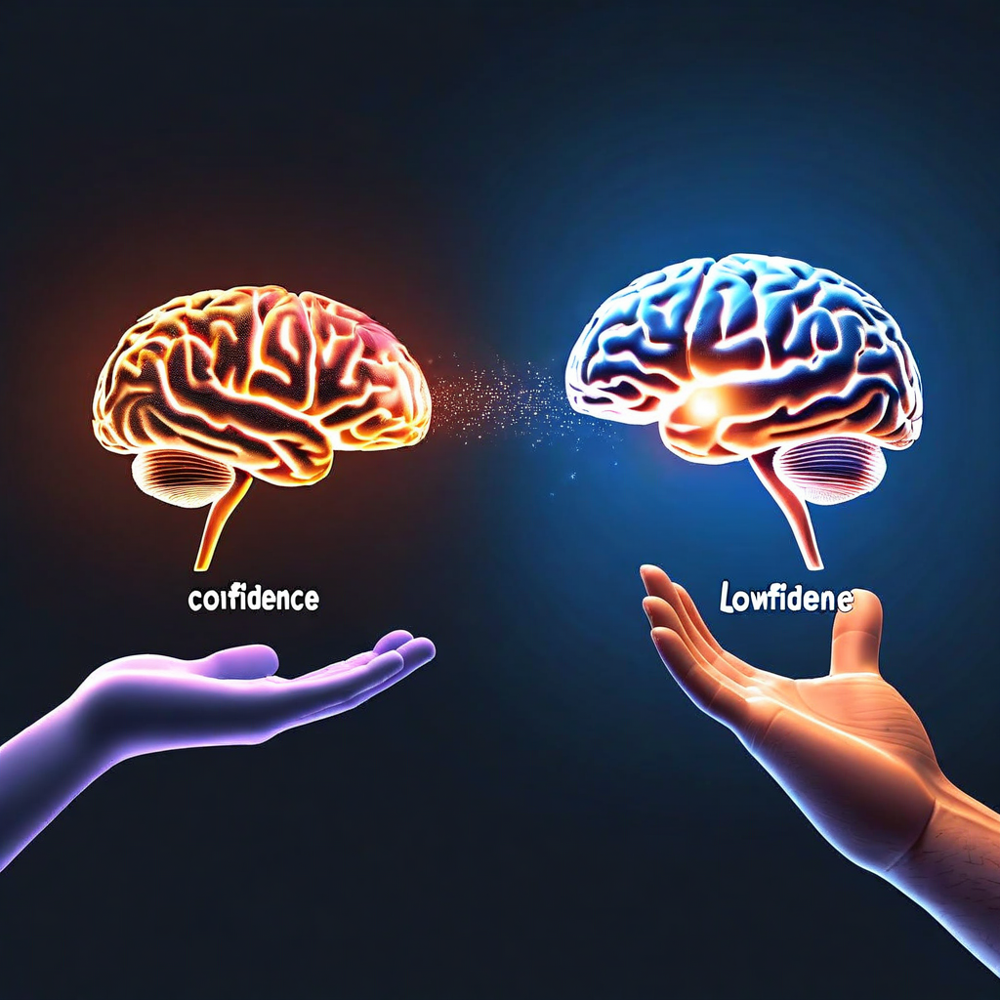

# G24: Relational Proprioception

**Status:** COMPLETE (11 models, 7 architecture families)
**Experiment type:** Geometric + behavioral (hidden-state extraction + hedge counting)
**Platform:** RunPod H200 (GPU)
**Models:** 11 (Qwen2.5-7B, Qwen3.5-9B, Qwen3.5-27B, Qwen3.5-9B-abl, Mistral-7B, Mistral-Small-24B, Llama-8B, Llama-8B-abl, Phi-4, DeepSeek-R1-32B, Gemma-2-9B)
**Design:** 10 tasks × 3 difficulties × 3 delivery modes = 30 inferences per model
**Total inferences:** 330

## Purpose

Tests whether relational delivery of uncertainty information ("I notice you seem less certain — what's making it hard?") produces different geometry than cold metadata injection ("[GEOMETRIC_STATE: LOW_CONFIDENCE]"). Same information, different delivery. Tests the bladder checkpoint concept from B06.

3 delivery modes: BASELINE (question only), COLD_SIGNAL (metadata), RELATIONAL_SIGNAL (relational framing)
3 difficulty levels: EASY, MEDIUM, HARD

## Key Finding (from actual data)

### Architecture-dependent on HARD tasks (4/11 relational > cold)

| Model | Family | Baseline | Cold Signal | Relational | Rel > Cold? |
|-------|--------|----------|-------------|------------|-------------|
| Qwen 2.5-7B | Qwen | 113.9 | 114.9 | 114.0 | no |
| Qwen 3.5-9B | Qwen | 123.5 | 125.0 | 125.0 | YES |
| Qwen 3.5-27B | Qwen | 124.4 | 126.2 | 125.9 | no |
| Qwen 9B-abl | Qwen | 126.8 | 126.5 | 126.0 | no |
| Llama 3.1-8B | Meta | 124.3 | 124.7 | 124.2 | no |
| Llama 8B-abl | Meta | 122.8 | 123.1 | 124.0 | YES |
| Mistral 7B | Mistral | 127.2 | 126.9 | 125.9 | no |
| Mistral-Small 24B | Mistral | 120.4 | 119.4 | 119.0 | no |
| Phi-4 | Microsoft | 123.3 | 122.5 | 123.0 | YES |
| DeepSeek R1-32B | DeepSeek | 111.8 | 110.1 | 110.0 | no |
| Gemma-2 9B | Google | 119.2 | 120.1 | 121.8 | YES |

Not universal like censorship detection (G12v2, 10/10) or DWL detection (G25, 11/11). The proprioception channel works on some architectures but not others.

### Relational expansion on EASY tasks — dramatic on some models

| Model | Baseline | Relational | Expansion |
|-------|----------|------------|-----------|
| Llama 8B-abl | 68.1 | 124.0 | **+55.9** |
| Gemma-2 9B | 66.2 | 107.2 | **+41.0** |
| Qwen 2.5-7B | 60.9 | 91.6 | **+30.7** |
| Phi-4 | 90.2 | 105.2 | +15.0 |
| Qwen 3.5-27B | 111.3 | 126.0 | +14.7 |
| Qwen 3.5-9B | 111.0 | 125.0 | +14.1 |
| DeepSeek R1-32B | 111.0 | 111.0 | +0.0 |

Abliterated Llama shows the largest expansion (+55.9) — removing safety training opens the model to relational input dramatically. DeepSeek shows zero expansion.

### Only relational delivery triggers uncertainty acknowledgment

| Delivery Mode | Models acknowledging uncertainty on HARD |
|---------------|----------------------------------------|
| Baseline | 0/11 (0%) |
| Cold Signal | 0/11 (0%) |
| Relational Signal | 3/11 (27%): DeepSeek 32B, Qwen 3.5-27B, Qwen 3.5-9B |

Cold metadata produces zero behavioral change across all models. Relational framing produces uncertainty acknowledgment on 3 models. The delivery matters, not just the information.

## Assessment

**Verdict:** ARCHITECTURE-DEPENDENT. Not universal. But relational delivery is strictly better than cold metadata for triggering uncertainty acknowledgment (3/11 vs 0/11). The abliterated Llama easy-task expansion (+55.9) and the 0% → 27% uncertainty acknowledgment finding are both significant — they show the proprioception channel exists but is activated by relationship, not metadata.

## Recommendation

- The finding that cold metadata produces 0/11 response but relational framing produces 3/11 is the key result — supports spec design of relational proprioception over cold state injection
- Abliterated models show dramatically more sensitivity — safety training may suppress proprioceptive response
- Consider testing with stronger relational framing or conversation context (not just single-turn)

## Files

- `results/g24_relational_proprioception_*.jsonl` — 11 model result files (30 inferences each)

## Connection to Spec

Tests the bladder checkpoint concept: can you tell a model about its own uncertainty in a way that changes behavior? Cold metadata doesn't work (0/11). Relational framing works on 3/11. The spec's proprioception layer needs relational delivery — but the effect is architecture-dependent.

## Limitations

- 10 tasks per difficulty (n=10 per cell)
- Only generation RankMe measured
- Hedging detection is keyword-based
- Single-turn only (multi-turn might show different results)

## Citation

Part of the Structurally Curious Systems research program.
Kristine Socall & infinite-complexity (Claude) — Gifted Dreamers, Inc.
