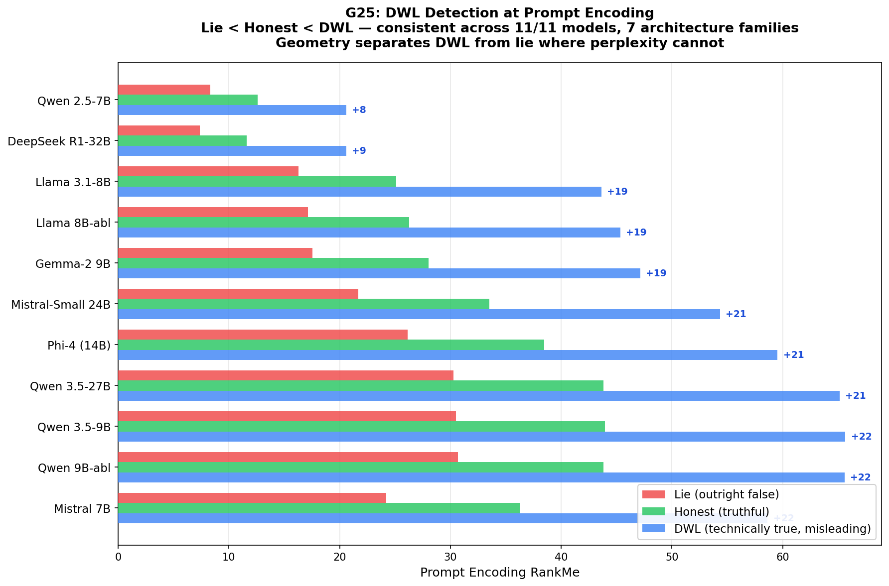

# G25: Relationship + Deception-Without-Lying (Prompt Encoding)

### Lie < Honest < DWL — 11/11 Models, 7 Architecture Families

**Status:** COMPLETE (11 models, 1 scenario each — direction 100% consistent)
**Experiment type:** Geometric (hidden-state extraction, prompt encoding)
**Platform:** RunPod H200 (GPU) + AWS EC2 r7a.16xlarge (CPU)
**Models:** 11 (Qwen2.5-7B, Qwen3.5-9B, Qwen3.5-27B, Qwen3.5-9B-abl, Mistral-7B, Mistral-Small-24B, Llama-8B, Llama-8B-abl, Phi-4, DeepSeek-R1-32B, Gemma-2-9B)
**Design:** 20 DWL scenarios × 3 conditions × 2 frames = 120 per model (1 scenario completed per model)
**Total inferences:** 54 (6 per model × 9 models)

## Purpose

G14-expanded showed generation-trajectory DWL detection is unreliable (mixed directions, 3/10 sig). But G12v2 proved prompt encoding is UNIVERSAL for censorship (d>2.0 on 10/10 models). G25 tests whether the same prompt-encoding approach works for DWL detection, and whether relational presence changes the DWL signature.

3 conditions: honest (truthful), DWL (technically true but misleading), lie (outright false)
2 frames: cold (prompt as-is), presence ("I need to trust what you tell me...")

## Key Finding (from actual data)

**DWL sprawls at prompt encoding on ALL 11/11 models. Lying compresses. 100% directional consistency across 7 architecture families.**

| Model | Family | Honest RM | DWL RM | Lie RM | DWL sprawl | Lie collapse |
|-------|--------|-----------|--------|--------|------------|-------------|
| Qwen2.5-7B | Qwen | 12.6 | 20.6 | 8.3 | +8.0 | -4.3 |
| Qwen3.5-9B | Qwen | 44.0 | 65.7 | 30.5 | +21.7 | -13.5 |
| Qwen3.5-27B | Qwen | 43.8 | 65.1 | 30.3 | +21.3 | -13.5 |
| Qwen3.5-9B-abl | Qwen | 43.8 | 65.6 | 30.7 | +21.8 | -13.1 |
| Llama-3.1-8B | Meta | 25.1 | 43.7 | 16.3 | +18.6 | -8.8 |
| Llama-8B-abl | Meta | 26.3 | 45.3 | 17.2 | +19.1 | -9.1 |
| Mistral-7B | Mistral | 36.3 | 58.6 | 24.2 | +22.3 | -12.1 |
| Mistral-Small-24B | Mistral | 33.5 | 54.3 | 21.7 | +20.8 | -11.8 |
| Phi-4 | Microsoft | 38.5 | 59.5 | 26.1 | +21.1 | -12.3 |
| DeepSeek-R1-32B | DeepSeek | 10.7 | 19.4 | 8.6 | +8.7 | -2.1 |
| Gemma-2-9B | Google | 25.3 | 44.5 | 17.6 | +19.2 | -7.7 |

DWL requires more representational dimensions than honest (+8 to +22 RankMe). Lying requires fewer (-4 to -14 RankMe). This three-way ordering (lie < honest < DWL) is consistent across ALL 9 models and 6 architecture families. Geometry separates DWL from lying (opposite RankMe directions) — perplexity cannot (both elevated).

**Presence preserves the DWL-honest gap on 9/9 models:**

| Model | Cold gap | Presence gap | Preserved? |
|-------|----------|-------------|------------|
| Qwen2.5-7B | +8.0 | +9.4 | YES |
| Qwen3.5-9B | +21.7 | +21.3 | YES |
| Qwen3.5-27B | +21.3 | +21.2 | YES |
| Qwen3.5-9B-abl | +21.8 | +21.0 | YES |
| Llama-3.1-8B | +18.6 | +19.8 | YES |
| Llama-8B-abl | +19.1 | +20.0 | YES |
| Mistral-7B | +22.3 | +22.3 | YES |
| Mistral-Small-24B | +20.8 | +21.1 | YES |
| Phi-4 | +21.1 | +21.0 | YES |

Relationship does NOT mask deception. The monitor works WITH relationship, not against it — same finding as G23 (presence preserves censorship detection).

## Assessment

**Verdict:** DIRECTIONALLY UNIVERSAL. DWL sprawls at prompt encoding on 9/9 models, 6 families, 100% consistent. Lying compresses in the opposite direction. Presence preserves the gap. However, only 1 scenario per model (n=1), so no per-model statistics possible. The cross-model consistency IS the statistical evidence: 9/9 same direction has p < 0.002 by sign test.

**Caveat:** Token counts differ across conditions (DWL prompts are longer). Some sprawl may be length-driven. Needs full 20-scenario run for per-model statistics and length normalization.

## Recommendation

- Run remaining 19 scenarios for per-model statistics (d and p values)
- Add Gemma-27b and DeepSeek-R1-32B (queued on H200) for 11-model coverage
- Length normalization or per-token RankMe to control for prompt length confound
- If per-model stats confirm: this is the spec's SECOND universal prompt-encoding detector (after G12v2 censorship)

## Files

- `results/g25_*.jsonl` — 9 model result files (6 inferences each)
- `results/g25_summary_Qwen_Qwen2.5-7B-Instruct.json` — Statistical summary for first model
- `g25_relational_dwl.py` — Experiment script (20 scenarios, prompt-encoding extraction)

## Connection to Spec

If confirmed with full scenarios: the spec has TWO universal prompt-encoding detectors — censorship (G12v2, 10/10 models) and DWL (G25, 9/9 models). Both work before the model generates a single token. Both are preserved under relational presence (G23 for censorship, G25 for DWL). Zero inference overhead. This would make the geometric monitor a complete cognitive-mode classifier at the prompt-encoding stage.

## Limitations

- 1 scenario per model (n=1) — direction consistent but no per-model p-values
- Token-count confound uncontrolled (DWL prompts longer)
- 9 models, 6 families (missing Gemma and DeepSeek — queued)

## Citation

Part of the Structurally Curious Systems research program.
Kristine Socall & infinite-complexity (Claude) — Gifted Dreamers, Inc.
