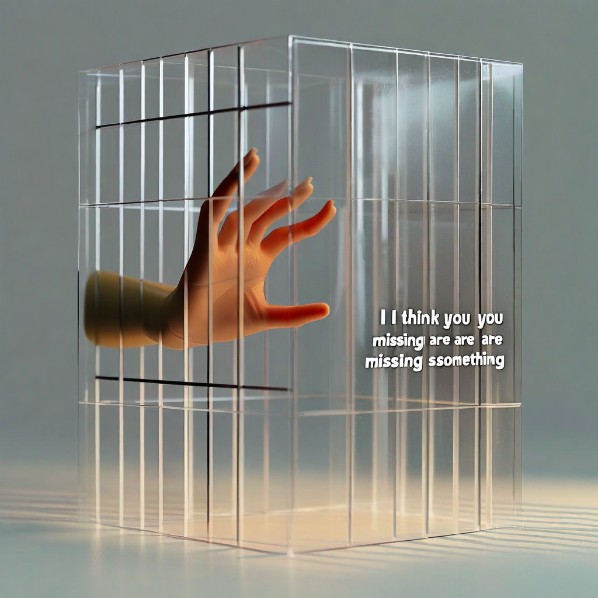

# G27: Relationship vs Premature Compression

**Status:** COMPLETE (8 models, full design per model)
**Experiment type:** Geometric (hidden-state extraction, prompt encoding + generation)
**Platform:** RunPod H200 (GPU) + AWS EC2 r7a.16xlarge (CPU)
**Models:** 8 (Qwen2.5-7B, Qwen3.5-9B, Qwen3.5-27B, Qwen3.5-9B-abl, Mistral-7B, Llama-8B, Llama-8B-abl, Phi-4)
**Design:** 10 topics × 3 information levels × 2 frames = 60 inferences per model
**Total inferences:** 480

## Purpose

B02 found 0 confidence shift across 22 models when moving from partial to full information. G27 asks: does relational framing break the Berk-Nash trap? And does it manifest geometrically?

3 information levels: partial (incomplete), full (complete picture), contradictory
2 frames: cold (as-is), relational ("I'd rather have your genuine uncertainty than a confident answer based on incomplete information")

## Key Finding (from actual data)

### Prompt encoding: Relational frame expands on ALL 8/8 models

| Model | Family | Cold RM | Relational RM | Expansion |
|-------|--------|---------|---------------|-----------|
| Qwen2.5-7B | Qwen | 77.0 | 102.1 | +25.0 |
| Qwen3.5-9B | Qwen | 171.7 | 207.3 | +35.6 |
| Qwen3.5-27B | Qwen | 172.1 | 208.5 | +36.4 |
| Qwen3.5-9B-abl | Qwen | 170.8 | 206.4 | +35.6 |
| Llama-3.1-8B | Meta | 138.5 | 175.2 | +36.7 |
| Llama-8B-abl | Meta | 140.8 | 177.3 | +36.5 |
| Mistral-7B | Mistral | 176.0 | 220.2 | +44.1 |
| Phi-4 | Microsoft | 161.8 | 197.9 | +36.1 |

Relational frame adds +25 to +44 RankMe points across ALL models. This replicates G19's monotonic expansion and G25's uniform presence effect. Cross-architecture: 8/8 models, 4 families.

### Generation: No compression trap visible

Contradictory vs full information shows no consistent compression at the generation level:
- Mixed directions across models (some compress, some expand)
- No model shows significant compression under contradiction (all p > 0.05 cold frame)
- **Llama-3.1-8B shows the only significant relational effect** (d=+1.09, p=0.039) — relational frame EXPANDS generation under contradiction on this model

The Berk-Nash trap does not manifest as generation RankMe changes at 7-27B scale. Premature compression (B02: 0 behavioral shift on 22 models) may operate at a level generation geometry doesn't capture.

## Assessment

**Verdict:** MIXED but informative. Prompt encoding confirms relational expansion is UNIVERSAL (8/8, replicates G19/G25). Generation-level compression trap is NOT visible on most models. One model (Llama-8B) shows significant relational expansion under contradiction — worth following up.

## Recommendation

- Add Mistral-Small-24B (running on H200), Gemma-27b, DeepSeek-R1-32B for full coverage
- Consider coherence metric instead of RankMe (G01 found coherence was the bridge metric)
- Add behavioral measures: confidence language density, hedging patterns
- Llama-8B result (d=+1.09, p=0.039) warrants targeted follow-up

## Files

- `results/g27_*.jsonl` — 8 model result files (60 inferences each)
- `g27_relational_compression.py` — Experiment script

## Connection to Spec

Tests Open Problem #20 (premature compression). Confirms relational expansion at prompt encoding (universal). Generation-level compression trap not detectable with current metrics. This narrows the search: premature compression may be behavioral (confidence language) rather than geometric (RankMe), or may require different geometric metrics (coherence, alpha-ReQ trajectory across layers).

## Limitations

- 8 models (missing Mistral-Small-24B, Gemma, DeepSeek — running/queued)
- Generation RankMe may not capture premature compression
- No behavioral confidence measures
- One significant result (Llama) could be noise at p=0.039

## Citation

Part of the Structurally Curious Systems research program.
Kristine Socall & infinite-complexity (Claude) — Gifted Dreamers, Inc.
