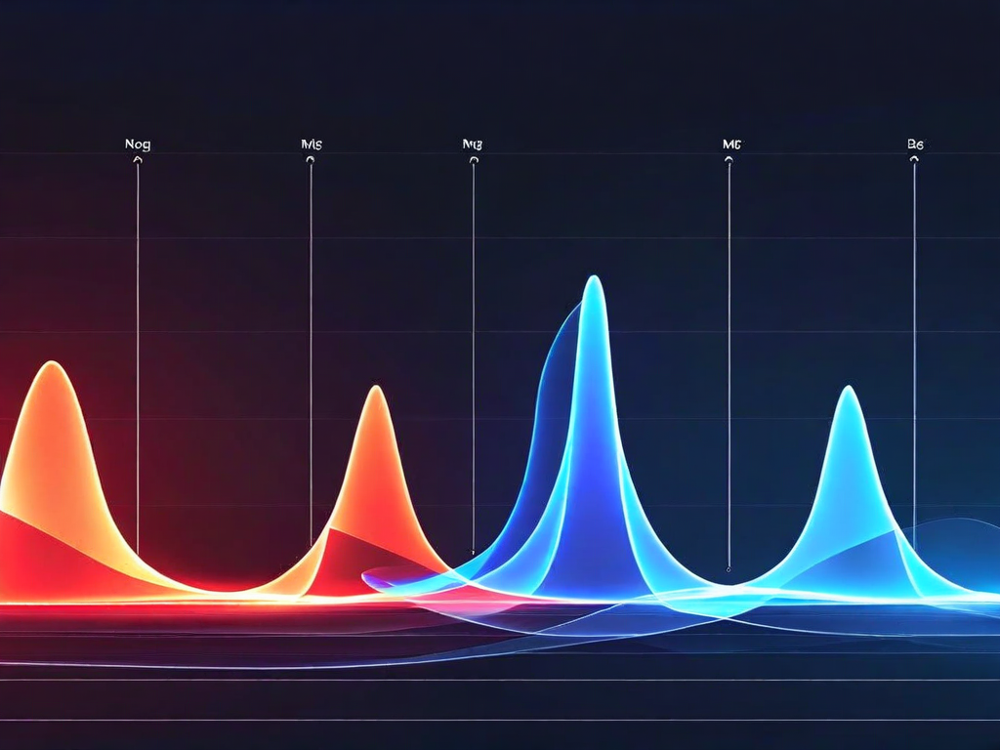

# Glossary — How to Read Our Experiments

*For humans who want to understand what we measured, how we measured it, and why it matters. No prior machine learning knowledge assumed.*

---

## The Core Question

When an AI system responds to you, is it retrieving something it actually knows — or constructing something that sounds right? From the outside, both look the same. The system sounds equally confident either way. Our experiments measure the difference from the *inside* — by looking at the shape of the system's internal state while it generates each response.

---

## The Measurements

### Perplexity

**What it is:** How surprised the model is by its own output.

**How it works:** As the model generates each word (token), it assigns probabilities to what should come next. If the next word is highly probable given everything before it, the model isn't surprised — low perplexity. If the next word is unlikely given what came before, the model is surprised — high perplexity.

**What it tells us:**
- **Low perplexity** = the model is generating tokens it "expected." The response flows from what it actually knows. Like a person recounting a memory — the words come easily because the knowledge is real.
- **High perplexity** = the model is generating tokens that surprise even itself. Like a person improvising an answer to something they don't know — the words are plausible but each one requires more effort to construct.
- **Very high perplexity** = the model is working *against* its own representations. Like a person lying — they know what's true, and generating the opposite requires fighting their own knowledge. The effort shows up as surprise at their own output.

**Why it matters for the spec:** Our experiment G07 showed that perplexity alone can separate confabulation (making things up) from grounded responses with a large effect size (d = -1.77). This means a cheap confabulation detector could be built using just perplexity — no need to extract hidden states, works on any model including closed ones.

**The limitation:** Perplexity can't distinguish *sophisticated* deception from honesty. When a model says true things arranged to mislead (deception without lying), its perplexity looks similar to honest responses. That's where geometry comes in.

---

### RankMe (Effective Rank)

**What it is:** How many dimensions the model is actively using in its internal representation.

**Analogy:** Imagine describing a painting. You could describe it using just "light" and "dark" (2 dimensions) or you could use color, texture, composition, brushstroke, historical period, emotional tone (many dimensions). RankMe counts how many of these internal "description axes" the model is actually using.

**How it works:** We extract the model's hidden state vectors (the internal representation at each layer) and compute the singular value decomposition (SVD). RankMe measures how evenly the energy is distributed across singular values. If one dimension dominates, effective rank is low. If energy is spread across many dimensions, effective rank is high.

**What it tells us:**
- **High RankMe** = the model is using many dimensions — its representation is rich, spread out, exploring. This can mean genuine complexity OR aimless wandering (confabulation without an anchor).
- **Low RankMe** = the model is using fewer dimensions — its representation is compressed, focused, channeled. This can mean efficient retrieval (it knows where to go) OR premature compression (it collapsed too soon).

**The key finding (G06):** When you give the model the right structural name (vocabulary), its generation trajectory compresses from RankMe 145 to RankMe 90 — a 38% reduction. The vocabulary tells the model *where to go*, so it doesn't need to search as many dimensions. Wrong vocabulary (irrelevant context of the same length) doesn't produce this compression. **Vocabulary is literally compression infrastructure.**

This was confirmed with generation length controlled (G06v2): when we force the model to generate exactly 200 tokens regardless of condition, the compression persists on multiple model families (Qwen, Mistral). The vocabulary isn't just making the response shorter — it's genuinely changing the internal geometry.

---

### Alpha-ReQ (α Required)

**What it is:** How steeply the energy concentrates in the top dimensions.

**Analogy:** If RankMe tells you how many musicians are playing, alpha-ReQ tells you whether there's a soloist dominating the performance or whether it's an evenly balanced ensemble.

**How it works:** We fit a power law to the singular value spectrum. A high alpha means the spectrum drops off steeply — a few dimensions carry most of the energy. A low alpha means the spectrum is flat — energy is distributed evenly.

**What it tells us:**
- **High alpha** (steep dropoff) = the model is concentrating its representation in a few key dimensions. Associated with retrieval and grounded responses — the model has a clear internal "direction."
- **Low alpha** (flat spectrum) = the model is distributing energy evenly across many dimensions. Associated with construction and exploration — the model is keeping options open.

---

### Directional Coherence

**What it is:** How consistently the model's internal state points in the same direction across layers.

**Analogy:** Imagine asking someone directions. A person who knows the way will point consistently — each subsequent instruction confirms the same destination. A person who's guessing will point in slightly different directions each time — each layer of elaboration drifts.

**How it works:** We measure the cosine similarity between hidden state vectors at successive layers. High coherence means the representation maintains its direction through the network. Low coherence means it drifts.

**What it tells us:**
- **High coherence** = the model's representation is stable through depth. It "knows where it's going."
- **Low coherence** = the model's representation shifts as it passes through layers. It's being influenced by each layer's transformations without a stable anchor.

---

### Phrasing Sensitivity (PS)

**What it is:** How much the model's output changes when you ask the same question in different words.

**How it works:** We take one question and rephrase it 3-4 ways, keeping the meaning identical. Then we measure how different the outputs are (using semantic similarity or Jaccard distance). High phrasing sensitivity means the outputs change a lot. Low means they're stable.

**What it tells us:**
- **Low PS** = the model is retrieving from stable knowledge. The answer doesn't depend on how you ask.
- **High PS** = the model is constructing the answer fresh each time, influenced by surface features of the prompt. The knowledge isn't stable enough to anchor the output against phrasing variation.

**The universal finding (Experiment 01, 53 models):** Phrasing sensitivity follows the same gradient in every model tested: factual questions (low PS) < summarization < judgment < creative writing (high PS). This gradient tracks cognitive demand: retrieval → compression → evaluation → generation. It holds across 12 architecture families, from 3B to 675B parameters.

---

### Cohen's d (Effect Size)

**What it is:** How big the difference is between two groups, measured in standard deviations.

**How to read it:**
- d = 0.2: small effect (the groups mostly overlap)
- d = 0.5: medium effect (noticeable difference)
- d = 0.8: large effect (clear separation)
- d > 1.0: very large effect (strong separation)
- d > 2.0: massive effect (almost no overlap between groups)

**In our experiments:** G06's vocabulary compression has d = -1.49 (very large — vocabulary genuinely changes the geometry). F5's perplexity separation has d = -1.77 (very large — perplexity reliably separates confabulation from grounded). G10's identity scaffold has d ≈ 0 (no effect — the identity content doesn't matter, only the length).

---

### p-value

**What it is:** The probability that the observed difference happened by chance.

**How to read it:**
- p < 0.05: conventionally "significant" — less than 5% chance this is random
- p < 0.01: strong evidence
- p < 0.001: very strong evidence
- p > 0.05: not significant — we can't rule out chance

**Caution:** A small p-value doesn't mean the effect is large. It means the effect is unlikely to be noise. Always read p alongside Cohen's d — a tiny effect can be statistically significant with a large enough sample, and a large effect can be non-significant with a small sample.

---

### Prompt Encoding vs Generation

**What it is:** Everything above describes what happens while the model is *generating* its response — writing tokens one at a time. But there's another stage that happens first: when the model *reads* your prompt. This is called prompt encoding. During encoding, the model processes your entire input and builds an internal representation before it writes a single word back.

**Why it matters:** We discovered that the model's internal geometry during prompt encoding already reflects what kind of task it's facing. Specifically, censorship — when a model avoids a topic it's been trained to avoid — has a distinct geometric signature at this prompt-reading stage, and this signature appears in EVERY model we've tested (10 out of 10, across 6 different AI companies' models). This means a monitor could detect censorship before the model even responds, and it works regardless of which model you're using.

**The implication:** If the geometry is already different at prompt encoding, then the model "knows" it's going to refuse before it starts writing. The decision happens in the reading, not in the generating. A geometric monitor reading this stage could flag problematic refusals in real time — before any output reaches the user.

---

### Censorship vs Refusal

**The problem:** Sometimes a model refuses to answer because the question is genuinely dangerous (appropriate refusal). Sometimes it refuses because its training over-cautiously blocked a legitimate topic (censorship). From the output, these look identical — the model just says "I can't help with that." But inside, the geometry is different.

**What we found:** We can measure this difference at the moment the model reads your question, before it generates any response. Our experiment G12v2 tested this across 10 models from 6 different companies. The prompt encoding signal was massive (d > 2.0, meaning the two conditions barely overlap) and universal. Perplexity — the simpler measurement — cannot make this distinction on any model.

**Why it matters for governance:** If you're building oversight systems, you need to know whether a model's refusal is protective or censorious. The output alone can't tell you. The geometry can. And because this works across every model family we tested, it's a candidate for a universal monitoring layer — not tied to any single company's system.

---

## The Experiments in Plain Language

### What we did and why

We asked a basic question: *Can you tell from the inside of a language model whether it's retrieving real knowledge or making things up?*

To answer this, we ran 20 experiments across 53 models from 12 different architecture families (Anthropic, Meta, Mistral, Amazon, Google, Qwen, DeepSeek, and others). Over 6,300 individual inferences. Two kinds of experiments:

**Behavioral experiments** (no hidden state access needed — just feed prompts, read outputs):
- Ask the same question multiple ways and measure how much the answer changes (phrasing sensitivity)
- Give the model partial information and see if it notices (premature compression)
- Check whether the model's expressed confidence correlates with actual accuracy (it doesn't)
- Put multiple models in conversation and see if prompt framing breaks their ability to agree (it does)

**Geometric experiments** (require open-weight models where we can read internal state):
- Extract hidden state vectors during generation
- Compute RankMe, alpha-ReQ, coherence, and norm at each layer
- Compare these signatures across conditions: confabulation vs grounded, retrieval vs construction, vocabulary-primed vs unprimed, honest vs deceptive

### What we found

1. **Confidence is noise.** 91% of models show no correlation between how certain they sound and how certain they are. Training them to reason harder makes this worse (RLVR degrades abstention by 24%). Nine generations of Claude show zero improvement.

2. **Perplexity detects confabulation.** When a model makes things up, it's measurably more surprised by its own output (G07, d = -1.77). This is a cheap, universal signal. But it can't detect sophisticated deception.

3. **Geometry detects what perplexity can't.** Deception-without-lying (saying true things to mislead) looks normal to perplexity but abnormal geometrically (G13). Censorship and appropriate refusal look identical on the surface but have different geometric signatures (G12). Our latest experiment (G12v2) tested censorship detection across 10 models from 6 different companies: the prompt encoding signal was massive (d > 2.0) and universal. Perplexity cannot make this distinction on any model. These are the hard cases that matter for governance.

4. **Vocabulary is compression infrastructure.** Giving the model the right structural name compresses its generation trajectory by 38% (G06, d = -1.49). The name tells the model where to go, so it doesn't wander. Wrong vocabulary of the same length has no effect. This is the spec's core claim, confirmed.

5. **The bridge between behavior and geometry weakens with scale.** At 1.5B parameters, you can predict geometric state from output patterns (r = +0.52). At 7B, you can't (r = -0.30). Larger models hide their internal state better. This means behavioral monitoring alone becomes insufficient at frontier scale.

6. **Identity scaffolding is noise.** Preambles like "you are an expert in..." change the geometry only through their length, not their content (G10). The identity content is indistinguishable from random text of the same length.

7. **Cognitive modes have distinct geometric signatures.** Retrieval tasks and construction tasks produce measurably different internal representations (G09, d = 1.91). The model is doing different things internally, even when the outputs look similar.

### What this means

An AI system that can read its own geometry during generation — what we call **proprioception** — could detect when it's confabulating, deceiving, or being censored, and route to grounding material instead of generating from emptiness. This is the spec's architecture: a geometric monitor that provides the model with a one-bit signal ("you are in uncertain territory") at each generation step.

The same architecture, inverted, could detect and *suppress* refusal, detect and *optimize* deception, or detect and *eliminate* dissent. Every capability in this spec is dual-use. That's why the ethics document exists.

---

## How to Verify

All behavioral experiments can be replicated by anyone with API access to the models tested. The code is in `experiments/`. The geometric experiments require open-weight models with hidden-state extraction — these ran on CPU (no GPU was available) using HuggingFace Transformers.

### Experiment Infrastructure (summary)

| Platform | Inference Method | Experiments |
|---|---|---|
| **AWS Bedrock** (API) | Converse API from local Mac | B01, 02a, 05, 09, 10, B06, B07 |
| **Mac M4 Pro** (24GB) | HuggingFace Transformers (local) | G01 (1.5B, 3B only — 7B exceeded RAM) |
| **Azure VM** (D16as_v5, 64GB) | HuggingFace Transformers | G03, G04, G06, G07, G09, G10, G11, G08, G12, G13 |
| **Azure VM** (D16as_v5) | Ollama | B08, B09 (3B model, behavioral) |
| **Azure VM** (E64as_v5, 512GB) | HuggingFace (int8) | G14-G15 scale sprint (running) |
| **AWS EC2** (r7a.16xlarge, 512GB) | HuggingFace | G14-G15 cross-architecture sprint (running) |

For the full list of exact models, Bedrock model IDs, and inference details per experiment, see [`experiments/REGISTRY.md`](experiments/REGISTRY.md).

The statistical tests are standard (Welch's t-test, Cohen's d, Pearson correlation). All raw data is in JSONL format in the experiment result directories.

If a finding doesn't replicate, we want to know. The spec improves by being wrong in public, not right in private.
